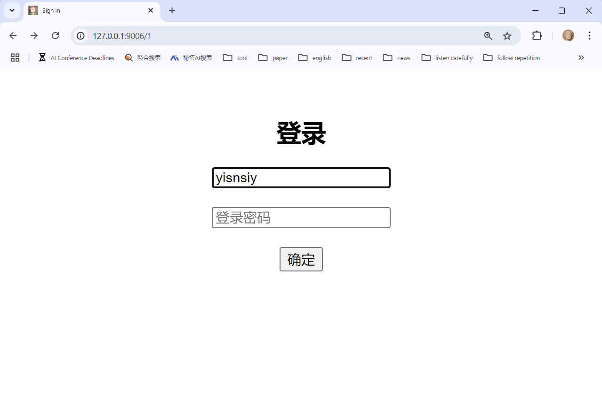
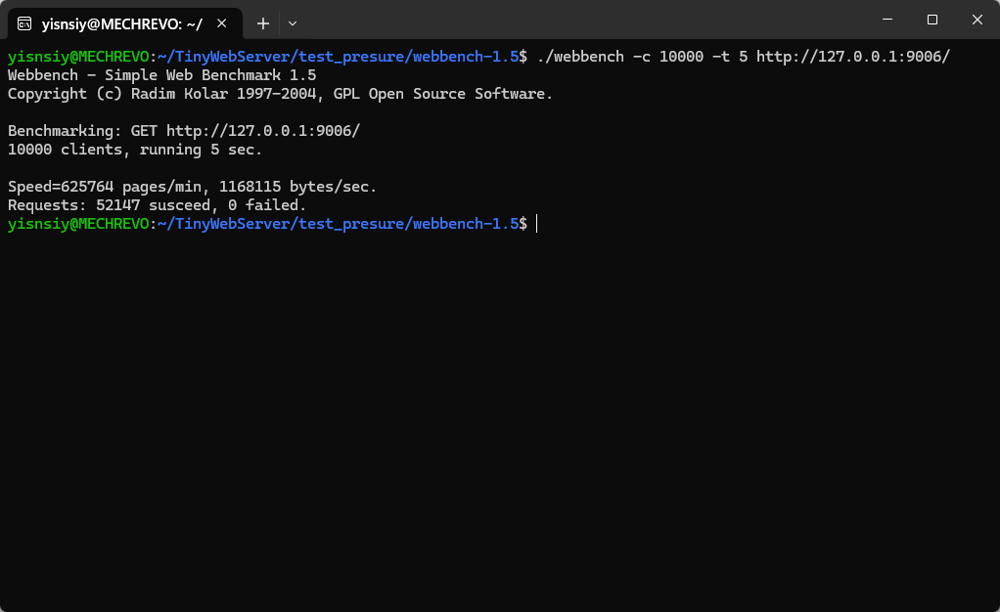

# 轻量级Web服务器


## 介绍
* 使用线程池 + 非阻塞socket + epoll(ET和LT均实现) + 事件处理(Reactor和模拟Proactor均实现) 的并发模型；
* 使用状态机解析HTTP请求报文，支持解析GET和POST请求；
* 访问MySQL服务器数据库实现web端用户注册、登录功能；
* 实现同步/异步日志系统，记录服务器运行状态；
* Webbench压力测试，可以实现10429.4 QPS的上万并发连接数据交换。

## 使用
1. 编译项目
```
bash ./build.sh
```

2. 运行项目
```
./server -p 9006
```

3. 浏览器进入
```
127.0.0.1:9006
```

4. 压力测试
```
# 进入压力测试的目录
cd ./test_presure/webbench-1.5

# 模拟1w个客户端，访问5秒
./webbench -c 10000 -t 5 http://127.0.0.1:9006/
```
